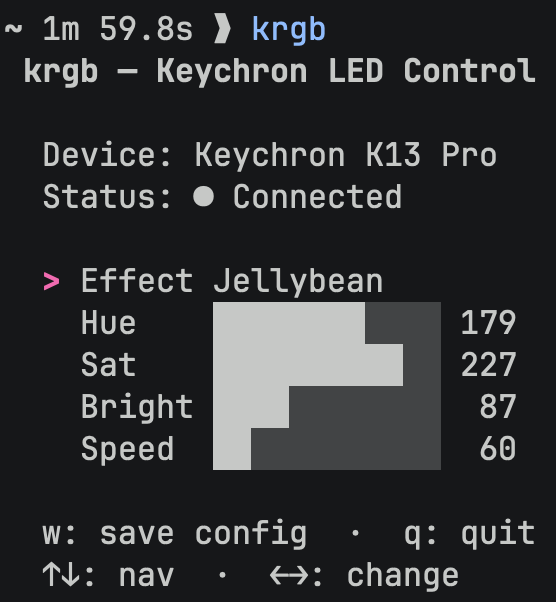

# krgb

Go TUI for controlling Keychron K-series keyboard LED colors via raw HID.



## Installation

### Homebrew

```sh
brew tap alesr/tap https://github.com/alesr/krgb
brew install krgb
```

### Build from source

```sh
git clone https://github.com/alesr/krgb
cd krgb
go build ./...
```

## Usage

    krgb

Requires a connected Keychron K-series keyboard with the raw HID interface.

## Platform Support

**macOS only.** Tested on Sequoia with Keychron K13 Pro.

Should work with other K-series models sharing the same raw HID interface, but only K13 Pro has been verified.

## License

MIT
